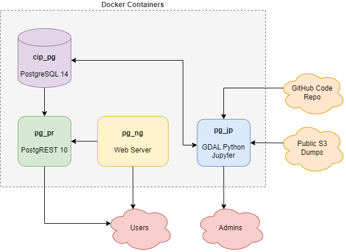

# cip20

Note the cip20 project entails several functionality layers of which only the first is presented here.  For the moment those layers might be explained as:

1. **Engine** to do one-by-one event indexing and proof/document the process.
2. **Batch** to process entire GIS files through event indexing returning results as file downloads.
3. **QA/QC** to allow persistance of batched processed datasets including authenticated review through visual inspection and alteration of batched results.

### Overview

The general idea is the docker-compose.yml and its accompanying .env file should be the only items you need to alter to get this project up and running.  If you end up having to alter the stack deeper down then please open a ticket to get that configuration moved up to the top.

Your security needs will vary quite drastically depending on whether you are deploying to a production environment or just testing on your local laptop.  However, the EPA repo security scanners make no such distinction so the default setup needs to be kept tight.  

### Prerequisites

- docker
- docker-compose (usually bundled nowadays with docker)
- at least 16 GB of memory
- at least 80 GB of free disk
- access to a public or deploy-key secured cip20 code repository

### Containers Utilized

The project uses the following containers which are standard, stable, trusted dockerhub images.  If you have any reason to distrust or find problematic any of the following, please open a ticket.

- postgis/postgist:14
- postgrest/postgrest:v10
- osgeo/gdal:ubuntu
- nginx

### Configuration

- inspect the docker-compose.yml file extension variables for appropriate settings for your host system.  Items that may need alteration include the exposed ports (perhaps you already have a server on one of the ports) and the PostgreSQL database settings.  If you are using a typical Windows deskop you would want to swap the server settings for the desktop settings.

- next generate an .env file in the root of project that contain needed security values.  The full list of keys that need values is located at the top of the docker-compose.yml file in the comments.

### Actions

1. in the root of the project, type **docker-compose build**.  This will download and configure the four containers.  It may take a while.

2. next type **docker-compose up --detach**.  This will spin up the containers applying the final alterations.  Note the cip_pr container will spin up fast and throw errors while it waits for the cip_pg database to come up.  These errors can be ignored.

3. next type *docker ps" to make sure all four containers are up and running as expected.  You should see cip_pg, cip_pr, cip_jp and cip_ng containers running.

4. next open the jupyter notebook using the cip_jp external port and the token you provided, e.g. http://localhost:8888/?token=easy

5. pilot to the **utilities** folder.

6. start with the **pg_restore cip20_support** notebook and execute all cells.  The cip20_support dump is very small and will download and load in under a minute veryifying the workflow is valid.

7. next move to the **pg_restore cip20_nhdplus_m** notebook doing the same actions.  The medium resolution NHDPlus dump is about 8 GB in size.  Thus it will take a while to download and load.  If you find yourself continually recreating the database you may wish to download that file off to the side and docker cp the file into new containers on-demand.  Then just skip over the download cell in the notebook.  

8. if you have the disk and the motivation to load the high resolution NHDPlus dump, then open the **pg_restore cip20_nhdplus_h** notebook.  This dump file is about 72 GB in size.  If you have many cores, adjusting the **thds** value in the first cell to allow more threads may help speed up the restore step.  However in truth you will probably be mostly limited by your disk throughput.  Note the high resolution NHDPlus data is not needed to test the project.

9. once the dumps are done loading you may wish to log into the database and verify the tables.  [pgAdmin](https://www.pgadmin.org/) is a free tool that works well enough for the purpose.

10. next move on to the **git_checkout cip20_support** notebook.  This notebook will clone and load the code logic from the cip20 github repository (probably this one).  The support codebase is quite small and will install in under a second.  You may wish to check that the functions are present through pgAdmin.

11. next run the **git_checkout cip20_nhdplus_m** and optionally the **git_checkout cip20_nhdplus_h** notebooks.  Part of the code logic involves generating materialized views needed by the code.  This will take several minutes for medium resolution NHDPlus and probably an hour or two for high resolution NHDPlus.  These views only need to be generated once so in theory its a one-time cost assuming the views themselves do not change.

12.  finally run the **git_checkout cip20_engine** and **git_checkout cip20_pgrest** notebooks.  These schemas only include code logic so will load almost instantaneously.

Clearly many of those steps could be merged to make setup more streamlined.  Its a bit of a balance in the early stages of development between automating everything and providing the means for careful inspection and ala carte processing and debugging.

After completion of the steps, point your browser to the nginx server, probably at http://localhost:8080/cip20_indexer.html
The indexer application should load up and allow you to draw a point, line or polygon and submit it for indexing.  That is all the project does at the moment.  Note the high resolution NHDPlus option will only work if the high resolution NHDPlus data and code was loaded.

Alternatively, try the ATTAINS comparison application, probably at http://localhost:8080/cip2_attains.html.  This web app is meant to show the results of cip20 indexing against indexing previous done by ATTAINS.

### Disclaimer

The United States Environmental Protection Agency (EPA) GitHub project code is provided on an "as is" basis and the user assumes responsibility for its use. EPA has relinquished control of the information and no longer has responsibility to protect the integrity, confidentiality, or availability of the information. Any reference to specific commercial products, processes, or services by service mark, trademark, manufacturer, or otherwise, does not constitute or imply their endorsement, recommendation or favoring by EPA. The EPA seal and logo shall not be used in any manner to imply endorsement of any commercial product or activity by EPA or the United States Government.
