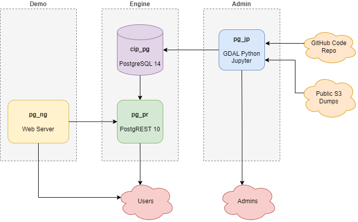
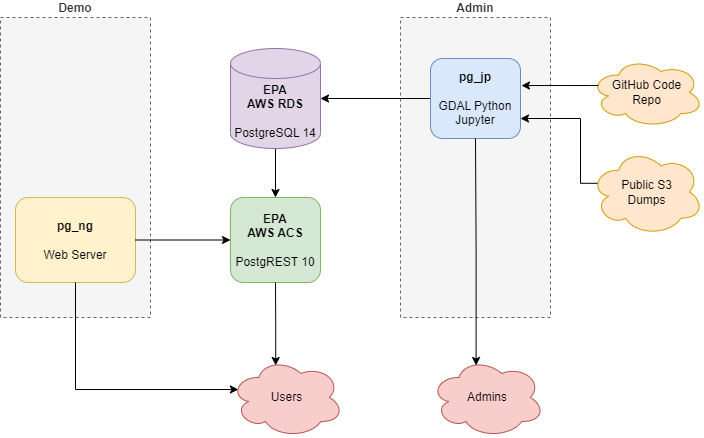

# CIP (Catchment Index Processing) Service

The Catchment Index Processing Service provides the ability to associate hydrologic features with NHDPlus catchments. The current project is divided into three "bundles" providing functionality through several combinations of Docker and standalone resources.

1. **Engine**: The engine bundle provides the core functionality of CIP.  At present there are two components, the database and the middleware API.
2. **Admin**: The admin bundle provides a set of Jupyter notebooks used in the deployment of CIP data and code to the engine.
3. **Demo**: The demo bundle provides a simple Nginx web server that hosts simple examples of CIP indexing.

### Capabilities

To explore the CIP-service API capabilities, see the [OpenAPI documentation](docs/openapi.yml).  Various OpenAPI 3.1 online renderers may be used to see the API rendered as document. Good examples would be the [Swagger Next Editor](https://editor-next.swagger.io/?url=https://raw.githubusercontent.com/USEPA/CIP-service/main/docs/openapi.yml) or the [OpenAPI Explorer](https://rhosys.github.io/openapi-explorer/?url=https://raw.githubusercontent.com/USEPA/CIP-service/main/docs/openapi.yml#?route=overview). Such viewers may not allow direct linking in which case the [direct link](https://raw.githubusercontent.com/USEPA/CIP-service/main/docs/openapi.yml) can be used to work around such issues.

### Overview

At this time hosting options for deploying the CIP-service bundles are quite varied ranging from Windows desktops to Linux servers to cloud hosting.  As such a single compose environment is challenging to present.  To accommodate this the project uses a jinja2 template combined with varied profile configurations to dynamically generate the needed compose and dockerfile artifacts that drive each bundle.  

To keep things simple the project promotes two general approaches, a complete local desktop Docker installation and a cloud option where the engine components are hosted in the EPA cloud. 

__Local Desktop__

__Cloud Hosted__

### Prerequisites

- docker
- [docker compose V2](https://docs.docker.com/compose/)
- at least 16 GB of memory
- at least 80 GB of free disk
- internet access

### Containers Utilized

The project uses the following containers which are standard, stable, trusted dockerhub images.  If you have any reason to distrust or find problematic any of the following, please open a ticket.

- postgis/postgist:14
- postgrest/postgrest:v10
- osgeo/gdal:ubuntu
- nginx

### Profile Configuration

- inspect the provided profiles or generate a new profile meeting your host specifications.  Generally for testing purposes the desktop.yml profile is expected to work for most users.

- generate the needed compose artifacts against the selected profile:
  - windows: 
    - ./config/config-compose.ps1 engine desktop
    - ./config/config-compose.ps1 admin admin_local
    - ./config/config-compose.ps1 demo nginx_demo
  - linux:   
    - ./config/config-compose.sh  engine desktop
    - ./config/config-compose.sh  admin admin_local
    - ./config/config-compose.sh  demo nginx_demo
  - python:  
    - ./config/config-compose.py --batch engine --bprofile desktop
    - ./config/config-compose.py --batch admin  --bprofile admin_local
    - ./config/config-compose.py --batch demo   --bprofile nginx_demo
  
these steps will generate the needed docker-compose.yml and Dockerfiles in each bundle directory.  Note running the Python configuration code directly on your host is the quickest and simplest of the above methods but requires Python 3 with the jinja2 package installed.

- next create .env files in the engine and admin bundle directories that contains needed security values.  See the [sample .env files](/engine/env.example) for typcial values to provide.

### Typical Deployment Steps

__Engine__

1. in the engine directory, type **docker compose -p engine build**.  This will download and configure the engine containers.  It may take a while.

2. next type **docker compose -p engine up --detach**.  This will spin up the engine containers.  Note the cip_pr container will spin up fast and throw errors while it waits for the cip_pg database to come up.  These errors can be ignored.

3. next type **docker ps** to make sure the engine containers are up and running as expected.  You should see cip_pg and cip_pr containers running.

4. At this point the engine API endpoint should be available.  For information on how to use the API, see the [OpenAPI specification here](https://petstore.swagger.io/?url=https://raw.githubusercontent.com/USEPA/CIP-service/main/docs/openapi.yml)

__Admin__

1. in the admin directory, type **docker compose -p admin build**.  The admin_local profile will attach o the engine_cip network created above.  

2. then type **docker compose - p admin up --detach**.

__Demo__

1. in the demo directory, type **docker compose -p demo build**. The nginx_demo profile expects to find the engine API at localhost, port 3000.

2. then type **docker compose - p demo up --detach**. 

### Typical Configuration Steps

1. open the admin bundle jupyter notebook using the token you provided, e.g. http://localhost:8888/?token=easy

2. pilot to the **utilities** folder.

3. for a straightforward load of the medium resolution NHDPlus, choose the **recipe_quick_setup_medonly** notebook and execute all cells.  This will download and stage the data and logic required.  Alternatively the **recipe_quick_setup_all** notebook will load the same plus the high resolution NHDPlus.  Note the high resolution datasets will require significant disk and time to stage and load.

After completion of the steps, point your browser to the demo bundle nginx server, probably at http://localhost:8080/cipsrv_indexer.html
The indexer application should load up and allow you to draw a point, line or polygon and submit it for indexing.  Note the high resolution NHDPlus option will only work if the high resolution NHDPlus data and code was loaded.

Alternatively, try the ATTAINS comparison application, probably at http://localhost:8080/cipsrv_attains.html.  This web app is meant to show the results of CIP Service indexing against indexing previous done by ATTAINS.

### Disclaimer

The United States Environmental Protection Agency (EPA) GitHub project code is provided on an "as is" basis and the user assumes responsibility for its use. EPA has relinquished control of the information and no longer has responsibility to protect the integrity, confidentiality, or availability of the information. Any reference to specific commercial products, processes, or services by service mark, trademark, manufacturer, or otherwise, does not constitute or imply their endorsement, recommendation or favoring by EPA. The EPA seal and logo shall not be used in any manner to imply endorsement of any commercial product or activity by EPA or the United States Government.
