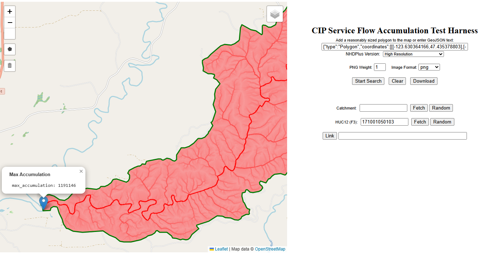
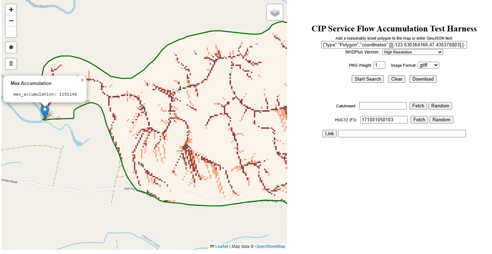

# Flow Accumulation with Pour Point Capability

NHDPlus is created through a combination of the National Hydrography Dataset, the Watershed Boundary Dataset and National Elevation datasets.  A core product is the national flow direction grid from which various further datasets are created. CIP-service provides this raster coverage as an [optional dataset](../admin/jupyter/notebooks/setup/pg_restore_cipsrv_nhdplusgrid_h.ipynb).

With a flow direction grid, one may calculate [flow accumulation](https://support.esri.com/en-us/gis-dictionary/flow-accumulation) for an arbitrary (though ideally sensible) drainage area.  As flow exits the drainage area, one or more pour points are defined as the point of largest accumulation(s).  The preceeding comment about sensibility of the area of interest applies as the watershed should be constructed to capture a single or at least a small number of pour points.

With CIP-service, flow accumulation functionality is exposed via optional REST services for **modest** analysis purposes.  Returning raster data via JSON has limits.  If users have the need to process large rasters, a better approach would be extration via tools such as [GDAL](https://gdal.org/en/stable/).  Howewver, for areas of interest about the size of a HUC12, the REST option does work.

Flow accumulation as a process occurs within the [fdr_flowaccumulation](../src/database/cipsrv_nhdplus_h/functions/fdr_flowaccumulation.sql#L12) function of the desired resolution.  The output of the function is a PostGIS raster and information about the cell having the maximum accumulation value.  In order to output a generic product suitable for display and analysis, the [flow accumumation service wrapper](../src/database/cipsrv_pgrest/functions/flow_accumulation.sql) converts the output into forms considered easier for exteranl digestion:

1. PNG image showing accumulation via a reddish scale
2. Standard georeferenced GeoTiff

The former file type is meant to be an easy way to eyeball results.  For example running flow accumulation against a known HUC12 **should** return results with a single pourpoint.

By contrast, the GeoTiff option is less pictureque in a web browser

but GeoTiffs can be straightforwardly downloaded and plugged into any GIS system for further geospatial analysis.

The current controls provided with the wrapper are simplistic by design, meant to quickly expose flow accumulation logic for review.  Alterations to the service wrapper are [welcome](../CONTRIBUTING.md).
