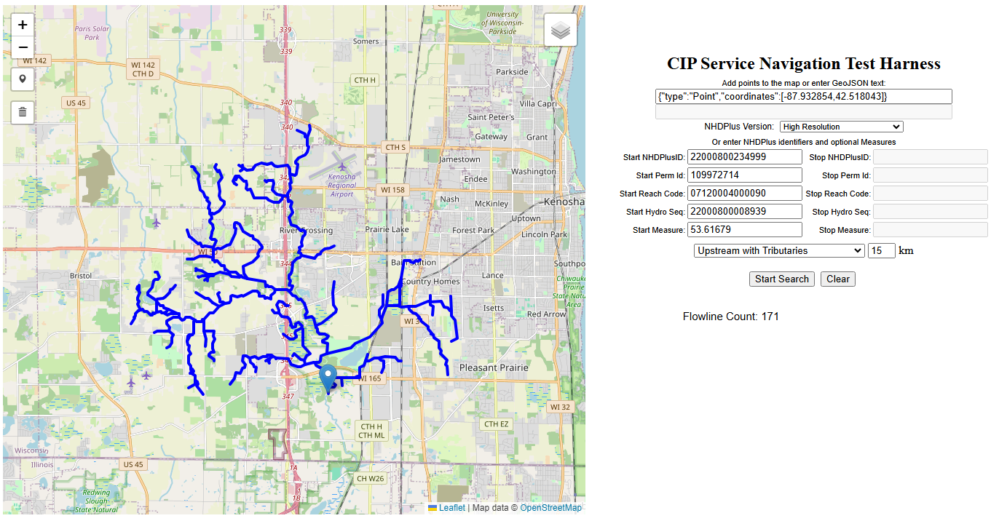
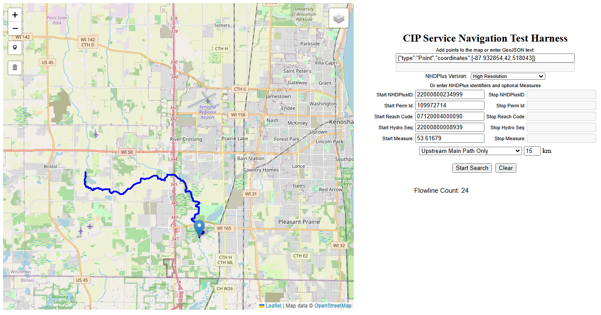
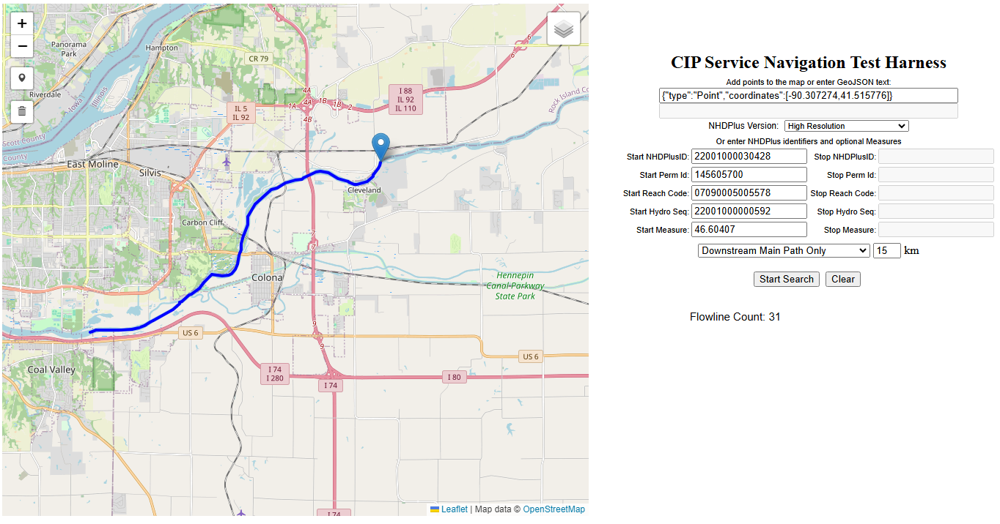
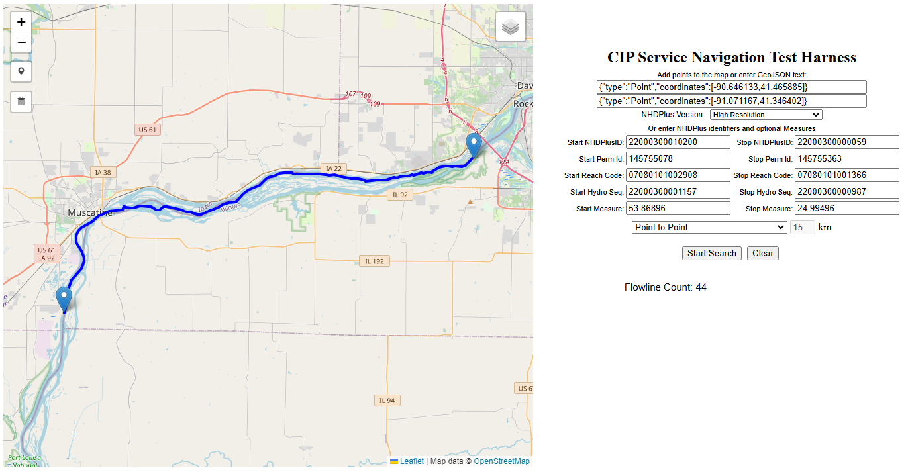
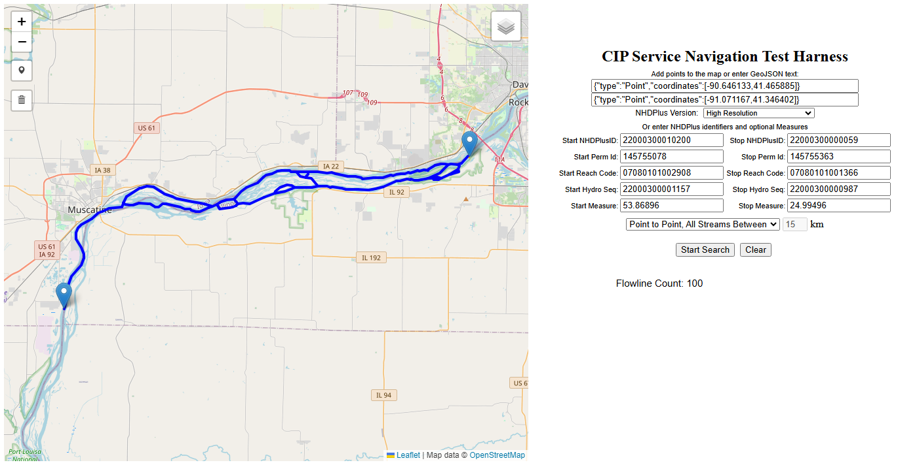
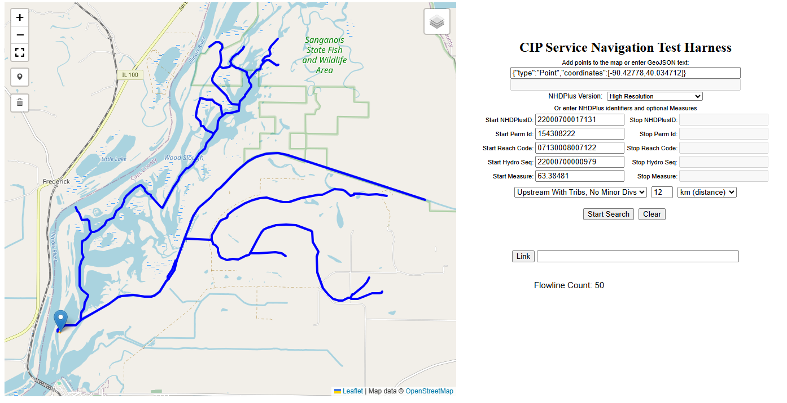

# Network Navigation
## Current Navigation Methods:

1. [Upstream with Tributaries](#upstream-with-tributaries)
2. [Upstream Mainline](#upstream-mainline)
3. [Downstream with Divergences](#downstream-with-divergences)
4. [Downstream Mainline](#downstream-mainline)
5. [Point to Point](#point-to-point)
6. [Point to Point All Between](#point-to-point-all-between)
7. [Upstream with Tributaries No Minor Divergences](#upstream-with-tributaries-no-minor-divergences)

### Upstream with Tributaries

Upstream with Tributaries (UT) is the most common form of navigation.  Navigation traverses up all available upstream routes with optional limiting by distance (km) or flow time (day) (MR only).  

In this illustration, the user is navigating upstream with tributaries (UT) for 15 km.  All flows upstream of the start point are returned.

### Upstream Mainline

Upstream Mainline (UM) is a form of upstream navigation which only follows the NHDPlus-defined main path of flow.  It may be optionally limited by distance (km) or flow time (day) (MR only).

In this illustration, the user is navigating upstream mainline (UM) for 15 km.  Only the upstream main path of the start point is returned.

### Downstream with Divergences

Downstream with Divergences (DD) is the usual form of navigation moving down the NHD network.  Navigation traverses all available downstream routes with optional limiting by distance (km) or flow time (day) (MR only). 

In this illustration, the user is navigating downstream with divergences (DD) for 15 km.  All flows downstream of the start point are returned.

### Downstream Mainline

Downstream Mainline (DM) is the main path version of downstream navigation limited by distance (km) or flow time (day) (MR only).

In this illustration, the user is navigating downstream mainline (DM) for 15 km.  Only the downstream main path of the start point is returned.

### Point-to-Point

Point-to-Point (PP) navigation utilizes the Dikstra algorithm to route the smallest cost flow path between two points.  Costs may be calculated in distance (km) or flow time (day) (MR only).  In the costing methodology main paths are heavily weighted to pressure routing to follow main paths when available.  

In this illustration, the user is navigating between two points (PP).  The best cost flow between the two are returned.

### Point-to-Point All Between

Point-to-Point All Between (PPALL) navigation is variation of Point-to-Point navigation where all possible flow paths between two points are returned.  Internally the logic functions by determining which point is upstream of the other and runs a Downstream with Divergences navigation ceasing when the second point is encountered.  Then from the downstream point the logic runs back Upstream with Tributaries only upon the paths returned from the first step.

In this illustration, the user is navigating between two points with all between (PPALL).  all possible flow paths between the two are returned.

### Upstream with Tributaries No Minor Divergences

Upstream with Tributaries No Minor Divergences (UTNMD) is a variation of Upstream with Tributaries navigation where the upstream traversal will decline to run upwards through minor divergences.  The usual scenario is one where a small network receives or can receive water - often via canal or overflow ditches - from a much larger major river network.  While that major river network is indeed upstream, the user in this case would prefer to receive results only for the small local network.  

In this illustration, the user is navigating upstream with tributaries no minor divergences (UT) for 15 km.  All flows upstream of the start point are returned **except** for where the small network receives water from the much larger Illinois river network.  For the Illinois river, the side channel into this local network is a minor divergence.
