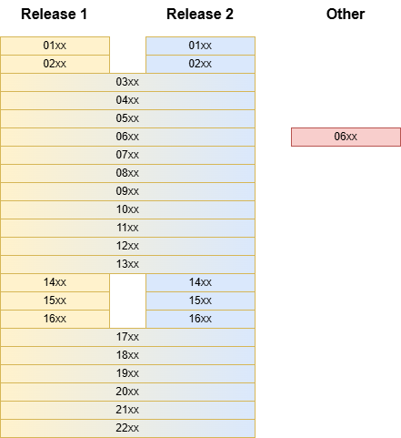

  #### NHDPlus HR in CIP-service

CIP-service leverages the [USGS NHDPlus HR dataset](https://www.usgs.gov/national-hydrography/nhdplus-high-resolution) to provide high resolution hydrography for indexing and analysis.  A key document is the [2025-1031 user guide](https://pubs.usgs.gov/sir/2025/5031/sir20255031.pdf) with direct data downloads provided on the [access national products page](https://www.usgs.gov/national-hydrography/access-national-hydrography-products).

NHDPlus HR was published in several steps moving from beta to release 1 to the final 2025 release 2.  This documentation seeks to describe these details in more depth.

Direct USGS Downloads:

* [Release 1](https://prd-tnm.s3.amazonaws.com/StagedProducts/Hydrography/NHDPlusHR/National/GDB/NHDPlus_H_National_Release_1_GDB.zip)
* [Release 2](https://prd-tnm.s3.amazonaws.com/StagedProducts/Hydrography/NHDPlusHR/National/GDB/NHDPlus_H_National_Release_2_GDB_2025-08-19.zip)
* [Rasters](https://prd-tnm.s3.amazonaws.com/index.html?prefix=StagedProducts/Hydrography/NHDPlusHR/VPU/Current/Raster/)

Release 1 and Release 2 differ in that the latter has updated data for regions 01, 02, 14, 15 and 16.  VPUs for the other seventeen regions are unchanged.  During these reprocesssing tasks, VPU set 06 was also redone with results posted to the VPU downloads.  This region 06 update is [**not** part of Release 2](https://prd-tnm.s3.amazonaws.com/StagedProducts/Hydrography/NHDPlusHR/National/GDB/Notes_and_Known_Issues_for_NHDPlus_NR2.pdf).

