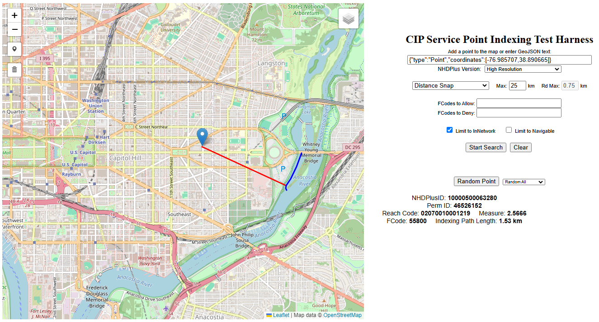
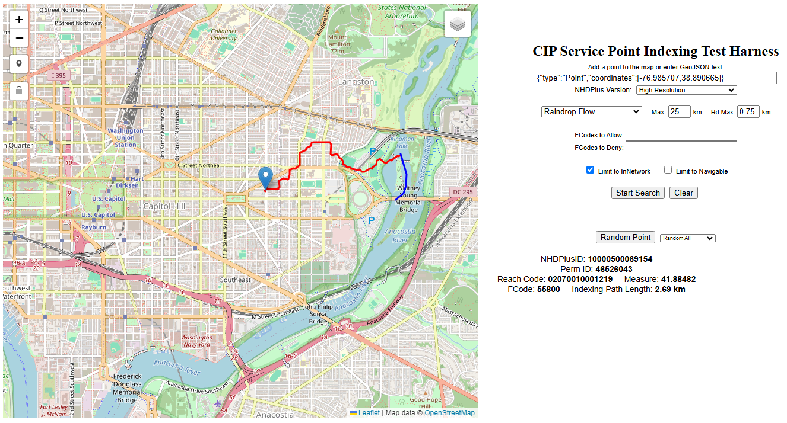
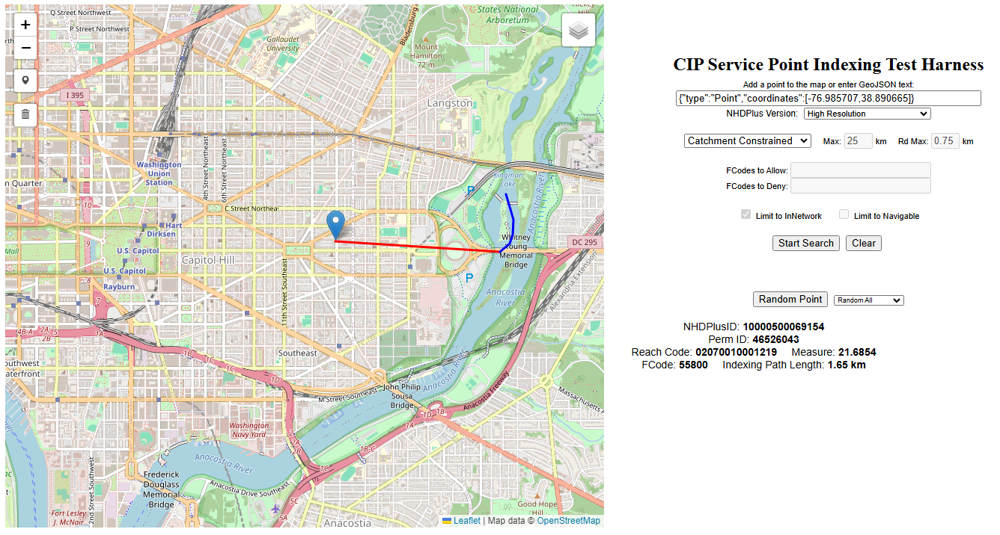

# Point Reach Indexing
## Current Indexing Methods:

1. [Distance](#distance)
2. [Raindrop](#raindrop)
3. [Catchment Constrained](#catchment-constrained)

### Distance

### Raindrop

### Catchment Constrained

