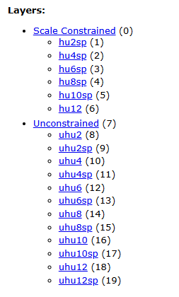

# Watershed Boundary Datasets

The NRCS and USGS Watershed Boundary Dataset (WBD) project began in 2009 as an undertaking to delineate a seamless national coverage of hydrologic units.  

> "Hydrologic units in the WBD provide a standardized base for water-resources organizations to locate, store, retrieve, and exchange hydrologic data; to index and inventory hydrologic data and information; to catalog water-data acquisition activities; and to use in a variety of other applications."
>
> <cite>[USGS](https://pubs.usgs.gov/tm/11/a3/pdf/tm11-a3_5ed.pdf)</cite>

The WBD HUC12 watershed system has become a standard unit of identification and classfication in the years since.  However, important to emphasize is that WBD units are consensus-based and underwent substantial revision between 2009 and 2025.  NHDPlus and other hydrological frameworks tied to WBD are perhaps better described as tied to specific WBD versions or vintages.

CIP-service provides multiple version of NHDPlus (MR and HR resolutions) with catchments each tied to multiple versions of WBD HUC12s.

* **NP21** - WBD associated with NHDPlus v2.1 
Each version of NHDPlus is constructed over several years utilizing the then most current version of WBD available.  As NHDPlus vector processing units (VPUs) are constructed generally in numeric order, VPU 01 uses a much earlier vintage of WBD than VPU 18 or 22.  Thus the WBD dataset provided in the [NHDPLus v2.1 final downloads](https://www.epa.gov/waterdata/get-nhdplus-national-hydrography-dataset-plus-data) (circa 2016) represent the WBD in a variety of vintages from 2012 to 2015. The release notes for each VPU need to be consulted and even then only a general range of the true vintage is possible.  Further complicating the matter, Alaska was not part of NHDPlus v2.1.  To fill this gap in coverage, the EPA Office of Water inserted WBD for Alaska from 2016.  Whilst a bit of a patchwork, this **NP21** WBD has been successfully used by many EPA programs for now over a decade.  Of the three datasets listed here, it is by far the one most likely to be encountered. 
EPA's Office of Water provides an online service of the **NP21** WBD here: https://watersgeo.epa.gov/arcgis/rest/services/Support/hydrologicunits_np21/MapServer

* **NPHR** - WBD associated with NHDPlus HR 
As with v2.1, the [USGS HR releases](https://www.usgs.gov/national-hydrography/nhdplus-high-resolution) of NHDPlus also contain a running vintage of WBD data.  Harvesting WBD dates by the many HR VPUs is provided in the accompanying xml metadata files - ranging from 2016 to 2020.  Notably VPUs in region 01 lack any offshore WBD coverage indicating the very early vintage of the extract.  For users seeking a modern WBD the **NPHR** dataset can appear very similar to the **NP21** version.  CIP-service provides the **NPHR** WBD for completeness but does not recommend its usage. 
EPA's Office of Water provides an online service of the **NPHR** WBD here: https://watersgeo.epa.gov/arcgis/rest/services/Support/hydrologicunits_nphr/MapServer

* **F3** - Final 20250107 WBD 
The very last revision to the Watershed Boundary Dataset was [published by USGS](https://prd-tnm.s3.amazonaws.com/index.html?prefix=StagedProducts/Hydrography/WBD/National/GDB/) on January 7th, 2025.  No further changes are anticipated this decade.  Water programs at EPA and other federal and state agencies are expected to migrate to this WBD over the oming years.  This WBD solves the various coverage gaps and ever-shifting vintages of the NP21 and NPHR datasets. 
EPA's Office of Water provides an online service of the **F3** WBD here: https://watersgeo.epa.gov/arcgis/rest/services/Support/hydrologicunits_f3/MapServer

### Simplifed WBD

EPA Office of Water has always offered a generalized version of WBD identified with a "sp" indicator.  CIP-service includes these simplified datasets for completeness.  However, all mappings between catchments and WBD is always done via the original unsimplified datasets.  Simplifed WBD is generally about 10% the size of the original WBD with remaining vertices chosen to best preserve the original shape.

### Office of Water WBD GIS services

The [services](https://watersgeo.epa.gov/arcgis/rest/services/Support/hydrologicunits_f3/MapServer) provided by the EPA Office of Water follow a long established format used in the [WATERS GeoViewer](https://www.epa.gov/waterdata/waters-geoviewer) to present WBD.

In the above layout, the first set of layers from 1 to 6 provide a scale-constrained view of the WBD system.  Viewing these layers at a small scale will show only the simplified HUC2 polygons.  Zomming in a bit will hide the HUC2s revealing the simplified HUC4s, zooming in further will move to the simplifed HUC6s, etc down to the large-scale unsimplified HUC12 layer.  This is a useful, friendly and performant method for exploring the WBD as a whole.  The second set of unconstrained layers from 8 to 19 are just the raw datasets.  Unconstrained layers are most useful for targeted examination of individual WBD layers.  Server performance will be poor when attempting the draw the entire unsimplified HUC12 layer at a national scale.  
